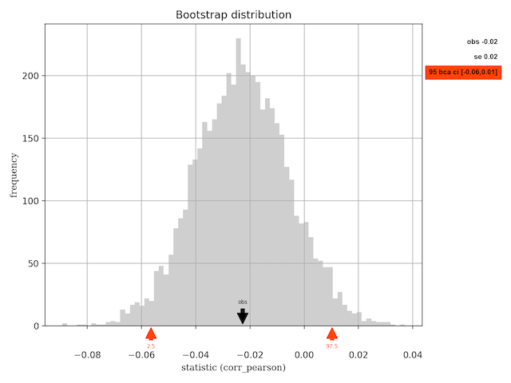

# Bootstrap sampling distribution #

[](https://github.com/elmomoilanen/Bootstrap-sampling-distribution/actions/workflows/main.yml)

Library that employs the statistical resampling method bootstrap to estimate a sampling distribution of a specific statistic from the provided sample of data. Estimates of standard error and confidence interval of the statistic can subsequently be determined from the obtained distribution, confidence interval being adjusted for both bias and skewness. Notice that the bootstrap resampling method is primarily based on frequentist principles.

Generally speaking, in statistical inference the primary interest is to quantify an effect size of a measurement and as a secondary but yet important thing would be to evaluate uncertainty of the measurement. This library provides computational tools for the latter with an assumption that the given data sample is a representative sample of the unknown population. This enables the use of the sample to generate new samples using the bootstrap resampling method.

Sampling distribution obtained by the bootstrap resampling process makes it possible to compute the standard error and confidence interval for the statistic, both quantifying statistical accuracy of the measurement. Standard error is the standard deviation of obtained values of the statistic whereas confidence intervals are constructed using the bias-corrected and accelerated bootstrap approach (BCa) which makes adjustments for bias and skewness.

At the moment, SciPy's API *stats.bootstrap* somewhat resembles this library but e.g. does not have integrated plotting.

## Install ##

Poetry is the recommended tool for installation.

Run the following command to install default dependencies within an in-project virtual environment

```bash
poetry install
```

In-project virtual environment setup is controlled by *poetry.toml*. Default dependencies are not enough to run the unit tests as pytest is required for that and it is only included in the optional `dev` dependency group which can be installed by adding `--with dev` to the command above.

For the plotting to work correctly it might be required to set the backend for Matplotlib. One way to do this is to set the MPLBACKEND environment variable (overrides any matplotlibrc configuration) for the current shell.

## Use ##

This section provides two short examples for usage of the library. To see the API docs, you can render the [documentation as HTML](#docs) or read the docstrings directly.

Start a new Python shell within the virtual environment e.g. as follows

```bash
MPLBACKEND= poetry run python
```

with a proper backend (e.g. macosx or qt5agg) after the equal sign. If the backend has been set correctly earlier, just drop this setting.

First let's consider a case where we assume X to be a numerical data with shape n x p (n observations, p attributes) and the 10th quantile to be the statistic of interest. Let's further assume that the number of attributes, p, is equal to or greater than three.

```python
import numpy as np
from bootstrap_sampling_distribution import SampDist

# One-dimensional statistics should be defined with axis=1
def quantile(x): return np.quantile(x, q=0.1, axis=1)

# Override default alpha and add random noise to bootstrap samples
samp = SampDist(quantile, alpha=99, smooth_bootstrap=True)

# Estimate sampling distribution simultaneously for columns 0 and 2
samp.estimate(X[:, [0,2]])

# Sampling distribution of the quantile for both columns
samp.b_stats

# Standard error (samp.se) and BCa confidence interval (samp.ci) are also available

# Plot the sampling distribution for the first column
samp.plot(column=0)
```

After the necessary module imports in the code snippet above, a custom quantile function was defined which calls NumPy's own quantile routine with the axis parameter equal to one. After an object of the *SampDist* class was instantiated, its estimate method was called in order to compute the sampling distribution, standard error and BCa confidence interval. Data slice of shape n x 2 was passed to the estimate method and as the quantile statistic is one-dimensional (maps n x 1 input to a single result and n x p input to p results) it ran the estimation simultaneously for both of the two attributes (columns 0 and 2 in X).

The following figure represents a possible result of the plot call. In addition to the histogram it shows the observed value (value of the statistic in original data sample) pointed to by the black arrow, standard error and BCa confidence interval pointed to by red arrows on x-axis.


For the second example, let's consider the estimation process of the sampling distribution for a multidimensional statistic, e.g. Pearson's linear correlation. Keeping the mentioned assumptions regarding data X, following code estimates the sampling distribution and in the final row of the snippet, renders a histogram plot similarly to the figure above. Compared to the previous example, notice the difference in estimation process of the chosen statistic. Here the multidimensional statistic, Pearson's correlation, requires two attributes (columns) of the data X as input (a data slice of shape n x 2) and produces a single output which is the value of correlation.

```python
from bootstrap_sampling_distribution import SampDist

# Import custom implementation of the Pearson's correlation
from bootstrap_sampling_distribution import corr_pearson

samp = SampDist(corr_pearson)

# Run estimation for columns 0 and 1. It's now mandatory to set multid to True
samp.estimate(X[:, :2], multid=True)

samp.plot()
```



Notice that the validity of the statistic is checked when calling the estimate method. If this check fails, a *StatisticError* exception will be raised. Furthermore, if the estimated sampling distribution is degenerate (e.g. data almost identical), a *BcaError* exception gets raised (in this case you may try to use True for the smooth_bootstrap parameter). Both exceptions inherit from class *SampDistError* which can be imported directly from the bootstrap_sampling_distribution namespace.

## Docs ##

Render the documentation as HTML files with the following command

```bash
poetry run sphinx-build -b html docs/source/ docs/build/html
```

and open the starting page `docs/build/html/index.html` in a browser.
